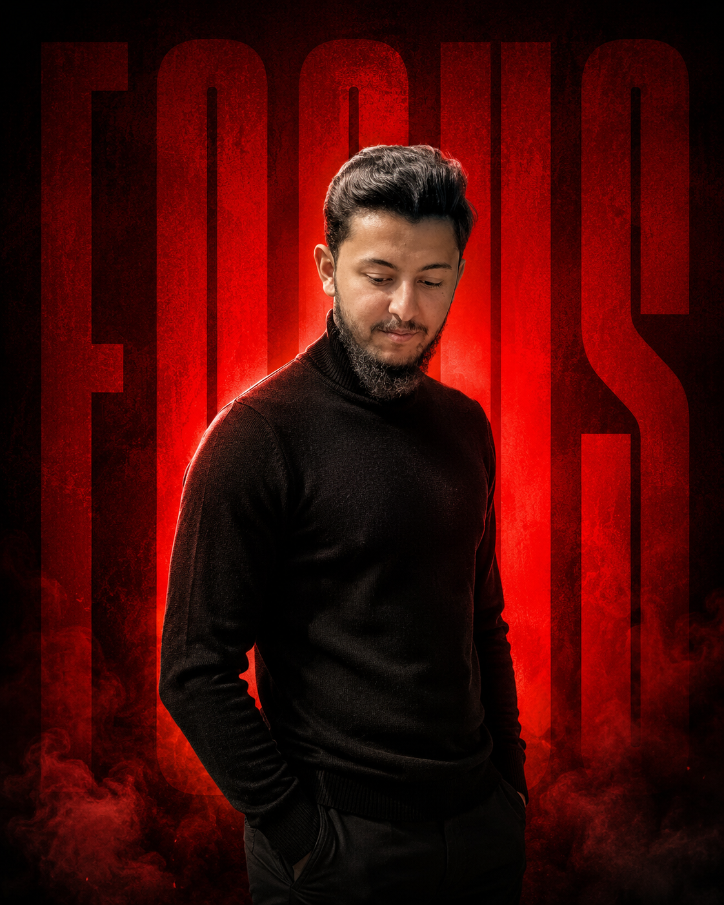
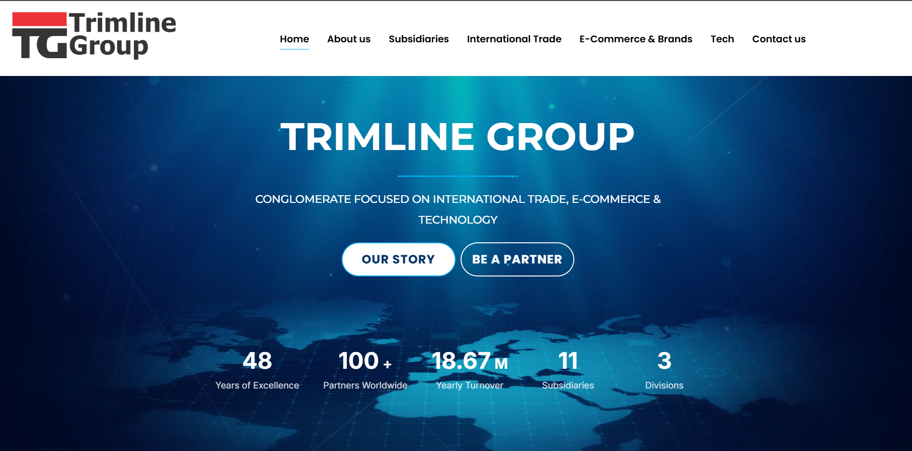
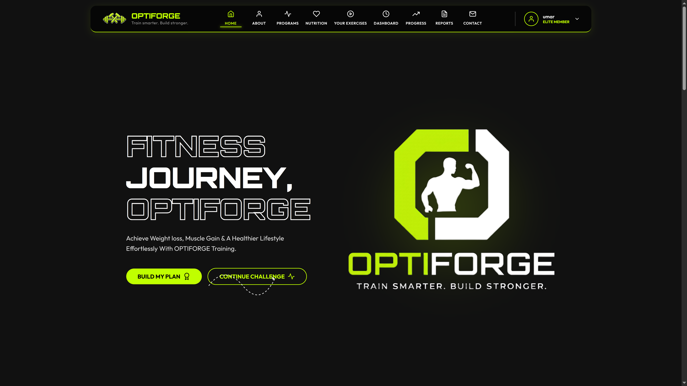
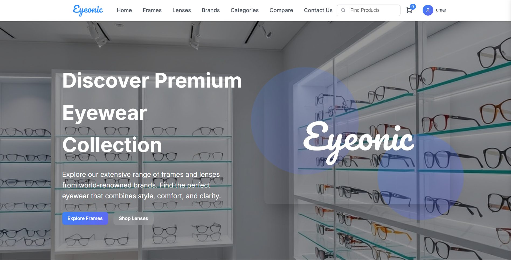

<div align="center">


<a href="https://github.com/UMAR-25-UMR">
  
</a>

<br/><br/>



<br/><br/>


</div>

<br/>


## 🧠 Who I Am

```ts
const umar = {
  title: "CS Student and Web Developer",
  stack: [
    "HTML", "CSS", "JS", "Bootstrap", "JSON",
    "React JS", "Tailwind CSS", "AI", "Antigravity", "Claude AI",
    "Firebase", "Supabase", "WordPress", "Figma", "C++",
    "GitHub", "Vercel", "Netlify", "Formspree API", "Google Analytics"
  ],
  launchedProjects: [
    "Trimline Group LLC Website",
    "Eyeonic E-Commerce Platform",
    "OPTIFORGE - AI-Powered Fitness & Gym Management Platform"
  ],
  certifications: [],
  status: "Building & shipping real-world web projects",
  openTo: ["Freelance web projects", "Collaboration", "Learning new tech"]
} as const;
```

<br/>

## 🚀 Featured Projects

<table width="100%">
<tr>
<td width="33%" valign="top">

<h3 align="center">🏭 Trimline Group</h3>

<p align="center">

</p>

<p align="center">

</p>

Live corporate site for a polymer supply company — responsive design, service sections, product info, and optimized performance.

| Layer | Tech |
|---|---|
| Frontend | HTML, CSS, JS, Bootstrap |
| Deploy | Vercel / Netlify |
| Analytics | Google Analytics |

<p align="center">
<a href="https://trimlineco.com/"></a>
<a href="https://github.com/UMAR-25-UMR/Trimline-Group-LLC-website-by-UMAR"></a>
</p>

</td>
<td width="33%" valign="top">

<h3 align="center">🏋️ OPTIFORGE</h3>

<p align="center">

</p>

<p align="center">

</p>

AI-powered fitness & gym management platform — workout plans, progress tracking, 21-day challenges, leaderboards, and interactive guidance.

| Layer | Tech |
|---|---|
| Frontend | React, Tailwind CSS |
| Backend/DB | Firebase |
| Deploy | Vercel |

<p align="center">
<a href="https://optiforge-jym.vercel.app/"></a>
<a href="https://github.com/UMAR-25-UMR/jym-website"></a>
</p>

</td>
<td width="33%" valign="top">

<h3 align="center">👓 Eyeonic</h3>

<p align="center">

</p>

<p align="center">

</p>

E-commerce platform for an eyewear brand — product listings, clean showcases, responsive layouts, and a smooth shopping experience.

| Layer | Tech |
|---|---|
| Frontend | HTML, CSS, JS, Bootstrap |
| Deploy | Vercel / Netlify |
| Forms | Formspree API |

<p align="center">
<a href="https://trimlineco.com/"></a>
<a href="https://github.com/UMAR-25-UMR/Trimline-Group-LLC-website-by-UMAR"></a>
</p>

</td>
</tr>
</table>

<br/>

## 🛠️ Tech Stack

<div align="center">

**Languages**
<br/>


<br/><br/>

**Frontend**
<br/>


<br/><br/>

**Backend / Infra**
<br/>


<br/><br/>

**Cloud / Deployment**
<br/>


<br/><br/>

**AI & Analytics**
<br/>


</div>

<br/>

## 📊 GitHub Stats

<div align="center">


<br/>


<br/><br/>


<br/>


</div>

<br/>


## 🤝 Connect With Me

<div align="center">

<a href="https://www.linkedin.com/in/umarimran22/">
  
</a>
<a href="https://umarportfolio.site">
  
</a>

</div>

<br/>


</div>
